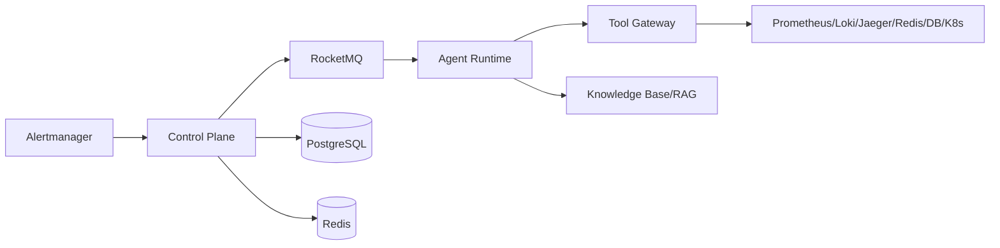

# AI SRE — 智能故障诊断与自愈平台

基于 Multi-Agent、RAG、MCP/Tool Calling 与 OpenTelemetry 的智能故障诊断与自愈平台。
项目从真实告警开始，自动完成去重聚合、故障任务创建、Metrics/Logs/Traces 查询、
Agent 推理、Runbook 检索、Root Cause 定位、修复方案生成、高风险操作人工审批、
Tool 执行、故障恢复验证和 Incident Report 生成。

## 解决的问题

- 故障响应依赖人工查询多个监控系统，MTTR 长。
- Agent 结论缺少可验证证据，难以信任。
- 高风险运维操作缺少权限控制与审计。
- 告警风暴淹没真正根因。

## Architecture Diagram



详见 [docs/architecture.md](docs/architecture.md)。

## 核心流程

1. Alert 接入 `POST /api/v1/alerts`
2. Redis 去重 + 服务窗口聚合
3. 创建 Incident 并发送 RocketMQ 诊断任务
4. Agent Runtime 执行 Planner + Diagnostic Agent
5. Tool Gateway 查询指标/日志/链路/K8s/Redis/DB
6. RAG 检索 Runbook
7. 输出结构化 Root Cause + Evidence + Recovery Plan
8. 高风险操作进入人工审批
9. 审批后执行恢复操作
10. Verification Agent 验证恢复
11. 生成 Incident Report

## 技术栈

- Control Plane: Java 17 / Spring Boot 3.4 / Spring Data JPA / Redis / RocketMQ
- Agent Runtime: Python 3.11+ / FastAPI / pluggable LLM Provider / Tool Registry / Hybrid RAG
- Demo Services: Python FastAPI / OpenTelemetry / Prometheus
- Observability: Prometheus / Grafana / Loki / OTel Collector / Jaeger
- Deployment: Docker Compose / Kubernetes / GitHub Actions

## Quick Start

```bash
# 启动核心环境
docker compose up -d

# 验证服务
curl http://localhost:8080/api/v1/incidents
curl http://localhost:8081/health

# 前端 Dashboard
# 打开 http://localhost:8083

# 注入故障
python fault-injection/inject_fault.py redis_pool_exhausted --enable

# 发送告警
curl -X POST http://localhost:8080/api/v1/alerts \
  -H 'Content-Type: application/json' \
  -d '{"service":"payment-service","alertName":"latency_high","resource":"payment-1","severity":"P1","summary":"payment p99 high"}'

# 运行 Agent 诊断（直接调用 Runtime）
curl -X POST http://localhost:8081/api/v1/agent/diagnose \
  -H 'Content-Type: application/json' \
  -d '{"incident_id":1,"alert":{"service":"payment-service","alertName":"latency_high","severity":"P1","summary":"redis pool exhausted"}}'
```

## 接入真实 LLM（OpenAI-compatible）

项目默认使用 Mock LLM 方便离线测试。如果需要接入 opencode / DeepSeek V4 Flash：

1. 复制环境变量文件：

   ```powershell
   Copy-Item .env.example .env
   ```

2. 修改 `.env`：

   ```env
   LLM_PROVIDER=openai
   OPENAI_BASE_URL=https://opencode.ai/zen/go/v1
   OPENAI_MODEL=deepseek-v4-flash
   OPENAI_API_KEY=你的APIKey
   ```

3. 启动：

   ```powershell
   docker compose up -d --build agent-runtime
   ```

Agent Runtime 会通过 OpenAI-compatible 协议调用：

```text
https://opencode.ai/zen/go/v1/chat/completions
```

## 本地测试（不依赖 Docker）

```bash
# Control Plane 单元测试
cd control-plane && mvn -o test

# Agent Runtime 单元测试
cd agent-runtime && python -m unittest discover -s tests -v

# 一键运行所有本地测试（单元 + E2E + Baseline）
python run_all_local_tests.py
```

## 安全

- JWT 登录：`POST /api/v1/auth/login`
- 高危写操作鉴权：审批决策、状态流转需要 Bearer Token
- Tool 分级：READ_ONLY / LOW_RISK / HIGH_RISK
- 风险等级由静态 RiskPolicy 定义，不由 AI 判断
- AI 只能推荐操作；高风险操作必须人工审批
- 诊断完成后会自动为高风险推荐操作创建审批请求
- 审批通过后自动调用 Tool Gateway 执行修复，并进入验证阶段
- Audit Log、敏感信息脱敏、Secret 通过环境变量注入

## Evaluation

- 200 个故障评测用例：`evaluation/cases/`
- 自动评测：`python evaluation/runner/run_evaluation.py`
- Baseline 对比：`python evaluation/runner/run_baseline.py`

## 测试

```bash
# Java 单元测试
cd control-plane && mvn -o test

# Python 单元测试 / Contract Test
cd agent-runtime && python -m unittest discover -s tests

# 本地完整 E2E（无需 Docker）
python e2e/local_contract_smoke.py

# 本地 Agent Benchmark
python e2e/local_benchmark_runner.py
```

## 部署

- Docker Compose：`docker compose up -d --build`
- 前端：`http://localhost:8083`
- Kubernetes：`deploy/k8s/`
- CI：`.github/workflows/ci.yml`

## 项目结构

```text
control-plane/       Spring Boot 控制面
agent-runtime/       Python Agent Runtime
tool-server/         Tool Gateway
demo-services/       演示微服务
knowledge-base/      Runbook/Postmortem
evaluation/          Case + Runner
fault-injection/     故障注入
observability/       Prometheus/Loki/OTel/Grafana 配置
web/                 简易前端 Dashboard
deploy/              Docker/K8s
benchmark/           k6 和并发脚本
docs/                架构/进度/评审/基准
```

## 文档

- [需求原文](docs/requirements.md)
- [架构](docs/architecture.md)
- [API 契约](docs/api-contract.md)
- [进度](docs/progress.md)
- [Benchmark](docs/benchmark.md)
- [需求覆盖清单](docs/coverage.md)
- [测试说明](docs/testing.md)
- [环境限制](docs/limitations.md)
- [Docker 验证记录](docs/docker-validation.md)
- [剩余需求说明](docs/remaining-requirements.md)
- [已实现功能清单](docs/implemented-features.md)
- [Production Readiness Audit](docs/production-readiness-audit.md)
- [Baseline Before Hardening](docs/baseline-before-hardening.md)
- [Configuration](docs/configuration.md)
- [Security](docs/security.md)
- [Upgrade](docs/upgrade.md)
- [Failure Mode Matrix](docs/failure-mode-matrix.md)
- [SLO](docs/slo.md)
- [Backup / Restore](docs/backup-restore.md)
- [API Docs](docs/api.md)
- [Operations](docs/operations/runbooks.md)

## Future Work

- 接入真实 LLM Provider（当前 mock / openai-compatible）与 pgvector 真实 embedding
- Chaos Mesh 故障注入实测（P2-FI-07 后需真实集群，见 docs/improvement-roadmap.md）
- K8s 修复执行与 RBAC/NetworkPolicy 实测（P0-10/P2-K8S-01）
- CD：镜像推送与不可变 tag（P3）
- 更多 Evaluation Case 与 Held-out split（P2-BM 后续）

> 当前完整现状与差距见 docs/production-readiness-audit.md 与 docs/limitations.md。