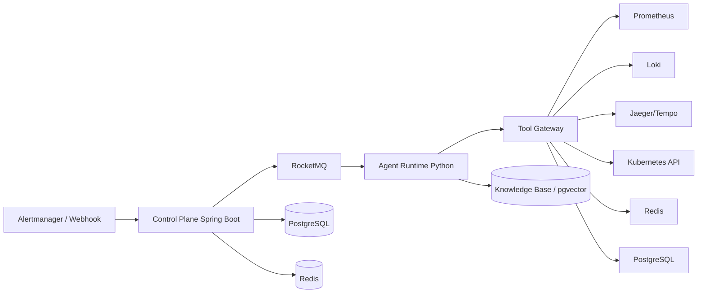
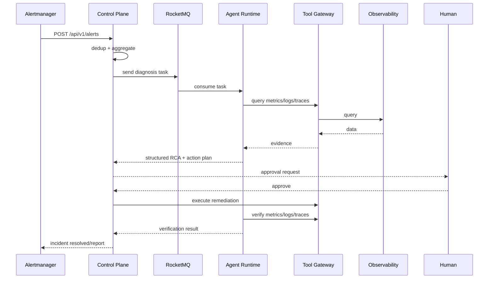
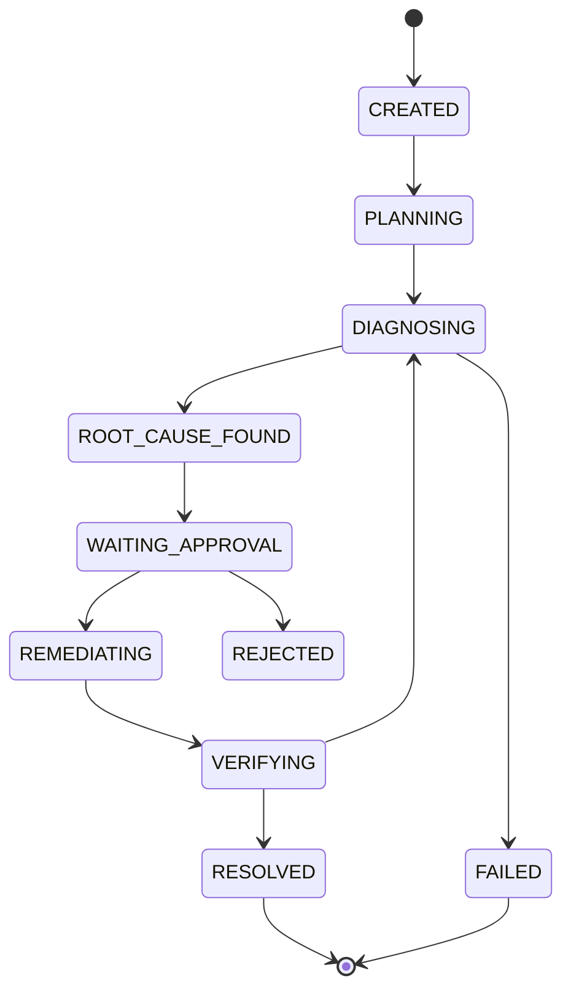
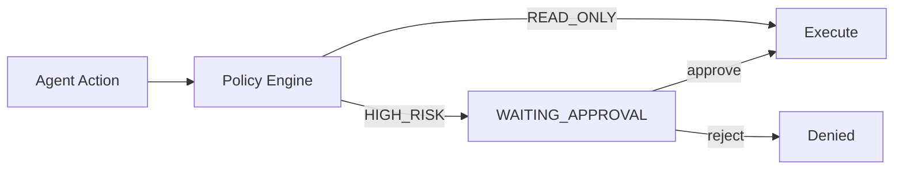

# AI SRE Architecture

## System Architecture

## Incident Sequence

## Agent State Machine

## Tool Permission Flow

## Database Schema

Core tables: `incident`, `alert`, `agent_task`, `agent_step`, `evidence`,
`tool_call`, `approval`, `remediation_action`, `audit_log`, `runbook`,
`evaluation_case`.

Indexes are designed for:
- alert dedup lookup: `alert(fingerprint, received_at)`
- incident list by status/service: `incident(status, started_at)`, `incident(service)`
- agent task query: `agent_task(incident_id)`, `agent_task(idempotency_key)`
- evidence/timeline query: `evidence(incident_id, collected_at)`
- audit/history query: `audit_log(incident_id, created_at)`

## API

| Method | Path | Description |
| --- | --- | --- |
| POST | `/api/v1/alerts` | Alertmanager webhook ingestion |
| GET | `/api/v1/incidents` | Incident list |
| POST | `/api/v1/incidents/{id}/transition` | Transition state machine |
| POST | `/api/v1/approvals/{id}/decision` | Approve/reject high-risk action |
| POST | `/api/v1/agent/diagnose` | Agent diagnosis (Agent Runtime) |
| POST | `/api/v1/agent/verify` | Recovery verification (Agent Runtime) |