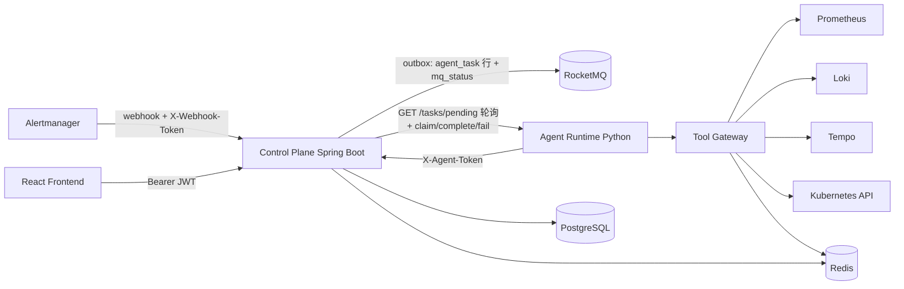
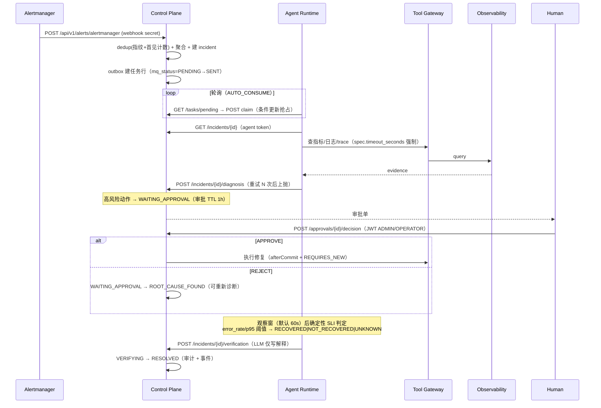
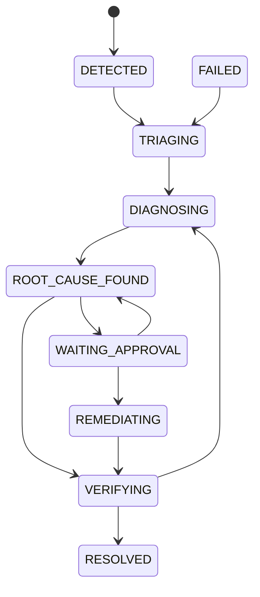
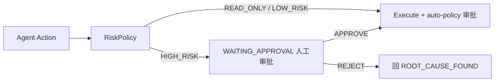

# AI SRE Architecture

> 与代码对齐版（2026-09）。生产路径 = 控制面轮询消费；RocketMQ 直连消费为
> EXPERIMENTAL（见 docs/security.md 与 agent-runtime/app/mq_consumer.py）。

## System Architecture



说明：
- MQ 消息由 CP outbox 产生（事务 afterCommit 发送 + 扫描器补发，P1-CP-07），
  但 agent-runtime 的 MQ 消费端**未接线**；任务分发的生产路径是轮询
  `GET /api/v1/tasks/pending` + 原子 `claim`（P1-MQ-01 方案 a）。
- 修复执行（HTTP 外呼 tool-server）在事务 afterCommit + REQUIRES_NEW 中运行（P1-CP-11）。

## Incident Sequence



## Incident State Machine（与 IncidentStateMachine.java 对齐）



非法流转抛 409（P1-CP-10）；并发更新由 Incident `@Version` 乐观锁保护（冲突同样 409）。

## Agent Task 生命周期（P1-MQ-02/03）

```text
QUEUED --claim(条件更新)--> RUNNING --complete--> COMPLETED
                                  |--fail------> FAILED
RUNNING(租约超时) --回收--> attempts+1: 未达上限 → QUEUED；达上限 → DEAD（毒任务，DLQ 等价物）
```

## Tool Permission Flow



## Database Schema

Flyway 单轨（V1..V7，`ddl-auto=validate`，P1-CP-17）。核心表：`incident`（@Version）、
`alert`、`agent_task`（idempotency_key 唯一、mq_status/mq_attempts、attempts/claim 租约）、
`agent_step`、`evidence`、`tool_call`、`approval`（expires_at、execution_token）、
`remediation_action`、`audit_log`、`runbook`、`evaluation_case`。

## API（主要端点）

| Method | Path | 鉴权 | 说明 |
| --- | --- | --- | --- |
| POST | `/api/v1/alerts/alertmanager` | X-Webhook-Token | 告警接入（未配置 secret 时放行+WARN） |
| GET | `/api/v1/incidents` | JWT ≥VIEWER 或 agent token | 事故列表 |
| POST | `/api/v1/incidents/{id}/diagnosis` | X-Agent-Token | 诊断回调 |
| POST | `/api/v1/incidents/{id}/verification` | X-Agent-Token | 验证回调 |
| POST | `/api/v1/incidents/{id}/transition` | JWT ADMIN/OPERATOR | 状态推进（非法→409） |
| POST | `/api/v1/approvals/{id}/decision` | JWT ADMIN/OPERATOR | 审批（过期/已决→409） |
| GET/POST | `/api/v1/tasks/*` | 读=JWT/agent token；claim/complete/fail=agent token | 任务生命周期 |
| GET | `/api/v1/stream` | 公开（EventSource 无法带头） | SSE 事件流 |
| POST | `/api/v1/auth/login` | 公开 | 登录（BCrypt，strict 模式禁默认口令） |

管理端点（metrics/prometheus）在独立端口 8085（P1-CP-14）。
